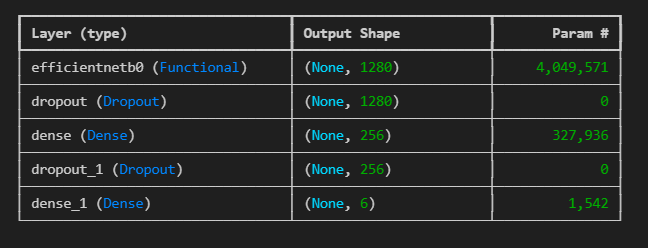
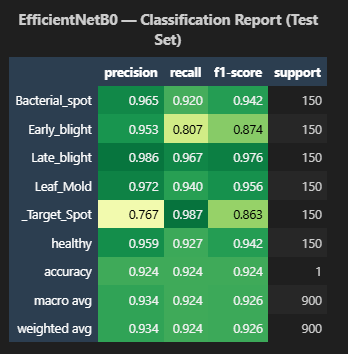
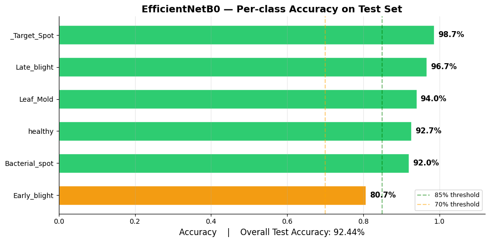
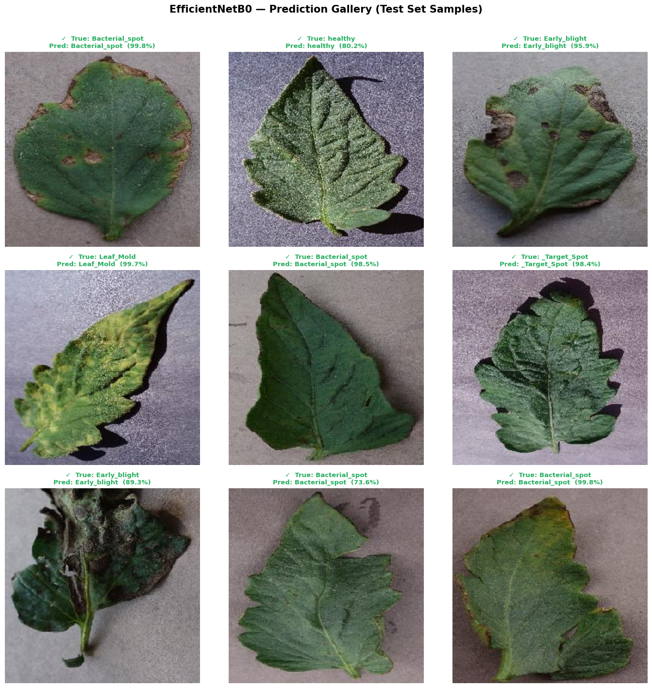
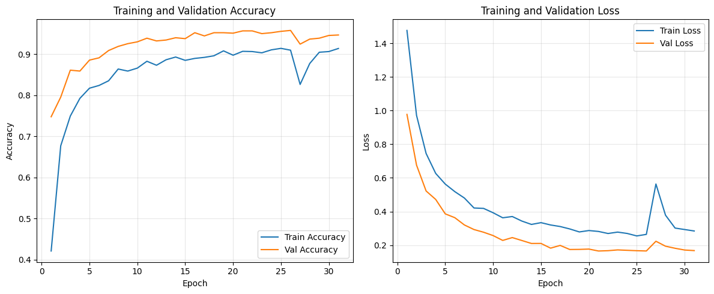

<div align="center">

# 🍅 Tomo Vision

### AI-Powered Tomato Disease Prediction System

*Detect tomato plant diseases instantly from leaf images using state-of-the-art deep learning*

[](https://python.org)
[](https://tensorflow.org)
[](https://fastapi.tiangolo.com)
[](https://reactjs.org)
[](https://expo.dev)
[](https://docker.com)
[](LICENSE)

</div>

---

## 📖 Overview

**Tomo Vision** is a full-stack AI application that leverages the **EfficientNetB0** deep learning model to accurately identify diseases in tomato plant leaves. Simply upload a photo of a tomato leaf — via the web app or mobile app — and the system instantly returns a diagnosis along with a confidence score.

Farmers, agronomists, and researchers can use this tool to quickly detect plant health issues and take timely action to prevent crop loss.

---

## 🎯 Supported Disease Classes

The model classifies tomato leaf images into **6 categories**:

| # | Class | Description |
|---|-------|-------------|
| 1 | 🦠 **Bacterial Spot** | Dark, water-soaked lesions on leaves and fruit |
| 2 | 🍂 **Early Blight** | Concentric ring-shaped brown spots |
| 3 | 💧 **Late Blight** | Dark, greasy-looking patches with white mold |
| 4 | 🌿 **Leaf Mold** | Yellow patches with olive-green mold on undersides |
| 5 | 🎯 **Target Spot** | Circular brown lesions with concentric rings |
| 6 | ✅ **Healthy** | No disease detected — plant is in good condition |

---

## 📸 Proof of Performance

### 🔬 Model Architecture

The system uses **EfficientNetB0** — a compact yet highly accurate CNN architecture — fine-tuned on the PlantVillage tomato dataset.



---

### 📊 Classification Report

Detailed per-class precision, recall, and F1-score across all 6 disease categories:



---

### 🎯 Confusion Matrix

Visualising true vs. predicted labels across the test set — showing the model''s strong diagonal performance:


---

### 📈 Per-Class Accuracy

Individual class-level accuracy breakdown demonstrating consistent performance across all disease types:



---

### 🖼️ Prediction Gallery

Real-world predictions made by the system — each image shows the uploaded leaf along with the predicted disease and confidence percentage:



---

### 💻 Live Application Output

Screenshot of the running web application showing a disease prediction result with confidence score:



---

## 🏗️ Architecture Overview

Tomo Vision follows a **microservices architecture** with three independently deployable components:

```
┌─────────────────────────────────────────────────────┐
│                    Tomo Vision                      │
├──────────────┬──────────────────┬───────────────────┤
│  🌐 Frontend  │   ⚡ API Server   │  📱 Mobile App   │
│  React 17    │   FastAPI        │  React Native    │
│  Port 3000   │   Port 8000      │  Expo / EAS      │
│              │                  │                  │
│  Material-UI │  EfficientNetB0  │  Camera / Gallery│
│  Dropzone    │  TensorFlow 2.11 │  Image Picker    │
└──────────────┴──────────────────┴───────────────────┘
                        │
              ┌─────────▼─────────┐
              │   🧠 ML Model     │
              │ latest_best_      │
              │ effnetb0.keras    │
              │ (224×224 RGB)     │
              └───────────────────┘
```

---

## 📁 Project Structure

```
Tomato_Disease_Prediction_System/
│
├── api/                          # ⚡ FastAPI Backend
│   ├── app.py                    #    Main API server & prediction logic
│   ├── main.py                   #    Entry point
│   └── requirements.txt          #    API-specific dependencies
│
├── frontend/                     # 🌐 React Web Application
│   ├── src/                      #    React components & logic
│   ├── public/                   #    Static assets
│   ├── package.json              #    Node dependencies
│   └── .env.example              #    Environment variable template
│
├── mobile/                       # 📱 React Native / Expo App
│   ├── App.js                    #    Main mobile application
│   ├── app.json                  #    Expo configuration
│   ├── assets/                   #    App icons & splash screens
│   └── package.json              #    Node dependencies
│
├── models/                       # 🧠 Trained Model Files
│   └── latest_best_effnetb0.keras #   Production model checkpoint
│
├── notebooks/                    # 📓 Training & Experimentation
│   ├── tomato_disease_model.ipynb          # Main training notebook
│   ├── tomato_disease_model_01.ipynb       # Experimental version
│   ├── using_imageDataGen.ipynb            # ImageDataGenerator approach
│   └── using_imageDataGen_colab.ipynb      # Google Colab version
│
├── photos/                       # 📸 Model Performance Evidence
│   ├── model-arch.png            #    EfficientNetB0 architecture diagram
│   ├── classification-report.png #    Precision / Recall / F1 scores
│   ├── Confusion Matrix.png      #    Confusion matrix heatmap
│   ├── per-class-acc.png         #    Per-class accuracy chart
│   ├── prediction-gallery.png    #    Sample predictions gallery
│   └── output.png                #    Live application screenshot
│
├── data/                         # 📦 Dataset directory
├── Dockerfile.api                # 🐳 API Docker image
├── Dockerfile.frontend           # 🐳 Frontend Docker image
├── Dockerfile.mobile             # 🐳 Mobile Docker image
├── docker-compose.yml            # 🐳 Full stack orchestration
├── requirements.txt              # 🐍 Python dependencies
└── Makefile                      # 🛠️  Build & run shortcuts
```

---

## ⚙️ Requirements

### System Requirements

| Component | Minimum |
|-----------|---------|
| Python | 3.8+ |
| Node.js | 14+ |
| RAM | 4 GB (8 GB recommended for training) |
| Disk Space | ~2 GB (model + dependencies) |

### Core Dependencies

**Backend / ML:**
- `tensorflow==2.11.0`
- `fastapi==0.95.2`
- `uvicorn==0.22.0`
- `pillow==10.1.0`
- `numpy<2.0.0`
- `python-multipart==0.0.6`

**Frontend:**
- `react@17.0.2`
- `@material-ui/core@4.x`
- `axios@1.x`
- `material-ui-dropzone@3.x`

**Mobile:**
- `expo`
- `react-native`
- `expo-image-picker`
- `expo-camera`

---

## 🚀 Installation & Setup

### Option A: 🐳 Docker (Recommended — One Command)

Run the entire stack (API + Frontend + Mobile) with Docker Compose:

```bash
# Clone the repository
git clone https://github.com/yshanukajay/Tomato_Disease_Prediction_System.git
cd Tomato_Disease_Prediction_System

# Build and launch all services
docker-compose up --build
```

| Service | URL |
|---------|-----|
| 🌐 Web Frontend | http://localhost:3000 |
| ⚡ API Server | http://localhost:8000 |
| 📱 Expo Mobile | http://localhost:19000 |

---

### Option B: 🛠️ Manual Setup

#### 1. Clone the Repository

```bash
git clone https://github.com/yshanukajay/Tomato_Disease_Prediction_System.git
cd Tomato_Disease_Prediction_System
```

#### 2. Backend — FastAPI Server

```bash
# Create and activate a virtual environment
python -m venv venv
source venv/bin/activate      # Linux / macOS
venv\Scripts\activate         # Windows

# Install dependencies
pip install -r requirements.txt

# Start the API server
cd api
python app.py
```

✅ API running at **http://localhost:8000**  
📖 Interactive docs at **http://localhost:8000/docs**

#### 3. Frontend — React Web App

```bash
cd frontend

# Install Node dependencies
npm install

# Set up environment variables
cp .env.example .env
# Edit .env and set:
# REACT_APP_API_URL=http://localhost:8000/predict

# Start the development server
npm start
```

✅ Web app running at **http://localhost:3000**

#### 4. Mobile — React Native / Expo

```bash
cd mobile

# Install Node dependencies
npm install

# Configure API URL in app.json under "extra":
# "apiUrl": "http://<YOUR_LOCAL_IP>:8000/predict"

# Start Expo
npm start
```

> **Tip:** Use your machine''s LAN IP address (e.g., `192.168.x.x`) instead of `localhost` for the mobile device to reach the API.

---

## 📡 API Reference

Base URL: `http://localhost:8000`

### `GET /ping`

Health check — verify the API is running.

**Response:**
```json
{ "status": "Backend is running" }
```

### `POST /predict`

Upload a tomato leaf image and receive a disease prediction.

**Request:** `multipart/form-data` with a `file` field (JPEG/PNG image)

**Response — Disease Detected:**
```json
{
  "class": "Tomato_Early_blight",
  "confidence": 0.9732
}
```

**Response — Not a Tomato Leaf (confidence < 0.5):**
```json
{
  "class": "Not a Tomato Leaf",
  "confidence": 0.2104,
  "message": "The uploaded image does not appear to be a tomato leaf. Please upload a clear image of a tomato plant leaf."
}
```

> The API uses a **confidence threshold of 0.5** — predictions below this are flagged as non-tomato images to avoid misleading outputs.

---

## 🧠 Model Details

| Property | Value |
|----------|-------|
| Architecture | EfficientNetB0 |
| Input Size | 224 × 224 × 3 (RGB) |
| Preprocessing | `preprocess_input` (EfficientNet-specific scaling) |
| Output Classes | 6 |
| Resize Strategy | `ImageOps.fit` with LANCZOS resampling |
| Confidence Threshold | 0.5 |
| Model File | `models/latest_best_effnetb0.keras` |

Training notebooks are available in the [`notebooks/`](notebooks/) directory with both local and Google Colab variants.

---

## 🛠️ Technologies Used

| Layer | Technologies |
|-------|-------------|
| **ML / Deep Learning** | TensorFlow 2.11, Keras, EfficientNetB0, NumPy, Pillow |
| **API / Backend** | FastAPI 0.95, Uvicorn, Python-Multipart |
| **Web Frontend** | React 17, Material-UI v4, Axios, Material-UI Dropzone |
| **Mobile** | React Native, Expo, Expo Image Picker, Expo Camera |
| **DevOps** | Docker, Docker Compose, GitHub Actions, Makefile |

---

## 🤝 Contributing

Contributions are welcome! Please feel free to submit a Pull Request.

1. Fork the repository
2. Create your feature branch: `git checkout -b feature/amazing-feature`
3. Commit your changes: `git commit -m ''Add amazing feature''`
4. Push to the branch: `git push origin feature/amazing-feature`
5. Open a Pull Request

---

## 📄 License

This project is licensed under the **MIT License** — see the [LICENSE](LICENSE) file for details.

---

## 👨‍💻 Author

<div align="center">

**Yohan Shanuka Jayakody**

[](https://github.com/yshanukajay)

*Built with ❤️ and a passion for AI-driven agriculture*

</div>
